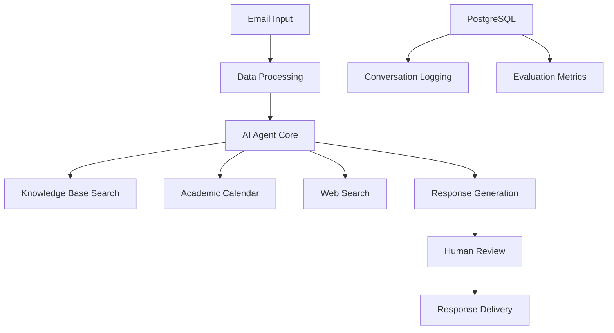

<div align="center">
  
</div>

# BSC Agent

## 🎯 Executive Summary

The **BSC Agent** is a pioneering Retrieval-Augmented Generation (RAG) AI system designed to revolutionize student support services at Brigham Young University-Idaho. As the university's inaugural AI project, this system addresses critical challenges in support ticket volume and response quality while maintaining BYU-Idaho's values of Christ-like service and academic excellence.

**Current Status**: 🚧 **Pilot Phase** - Proof of concept with stakeholder validation in progress

## 📋 Problem Statement

The BYU-Idaho Support Center (BSC) faces significant operational challenges:

- **Low email satisfaction scores** due to delayed response times
- **High operational costs** from managing 25+ part-time positions
- **Inconsistent information delivery** during peak support periods
- **Training overhead** and scheduling complexities for student workers

---

## 📋 Project Overview

### Problem Statement

The BYU‑Idaho Support Center (BSC) currently contends with an overflowing email inbox—far more messages arrive each day than its team of 25 part‑time student agents can feasibly address. This backlog leads to delayed responses and, as recent CSAT surveys confirm, diminished satisfaction characterized by long wait times and inconsistent answers. The manual effort spent triaging and drafting repetitive replies also diverts valuable staff hours away from higher‑value engagements such as real‑time phone or chat support.

The BYU-Idaho Support Center (BSC) faces significant operational challenges:

- **Low email satisfaction scores** due to delayed response times
- **High operational costs** from managing 25+ part-time positions (estimated > $100,000/year)
- **Inconsistent information delivery** during peak support periods
- **Training overhead** and scheduling complexities for student workers
- **Variable service quality** impacting student experience

### Solution

An intelligent AI agent that:

1. **Automatically processes** incoming student support emails
2. **Searches knowledge base** using semantic search upon the existing BSC knowledge base (from Genesys Cloud, vectorized with OpenAI's embedding model, stored in Pinecone)
3. **Generates contextual responses** grounded in official BYU-Idaho policies
4. **Maintains human oversight** through approval workflows
5. **Ensures compliance** with FERPA and institutional values

---

## 🏗️ Technical Architecture

### Core Components



### Technology Stack

| Component               | Technology                       | Source                          | Status    |
| ----------------------- | -------------------------------- | ------------------------------- | --------- |
| **Agent Platform**      | n8n                              | `https://byui.app.n8n.cloud/`   | 🟡 Pilot  |
| **Language Model**      | OpenAI `GPT-4.1`                 | `https://platform.openai.com/`  | ✅ Active |
| **Embedding Model**     | OpenAI `text-embedding-3-large`  | `https://platform.openai.com/`  | ✅ Active |
| **Vector Database**     | Pinecone                         | `https://app.pinecone.io/`      | 🟡 Pilot  |
| **Database**            | Azure PostgreSQL Flexible Server | `https://portal.azure.com/`     | ✅ Active |
| **Evaluation Platform** | Label Studio                     | `https://app.humansignal.com/`  | 🟡 Pilot  |
| **Knowledge Base**      | Genesys Cloud                    | `https://apps.usw2.pure.cloud/` | ✅ Active |

### System Projects

- n8n: `BSC Agent`
- OpenAI Platform: `BSC Agent`
- Pinecone: `AI Agents` (index: `bsc-knowledge`)
- Azure PostgreSQL Flexible Server: `byui-gospel-library-db`
- Label Studio: `BSC Agent`

### Key Features

#### 🤖 Intelligent Agent Capabilities

- **Multi-tool Integration**: Knowledge base, academic calendar, web search, escalation
- **Contextual Memory**: Conversation tracking and context retention
- **Escalation Logic**: Automatic handoff for complex cases (e.g. safety emergencies, policy violations, sensitive matters)
- **Values Alignment**: Built-in BYU-Idaho mission and values integration

#### 🛡️ Safety & Compliance

- **FERPA Compliant**: Privacy protection for student records
- **Escalation Protocols**: Safety emergencies, policy violations, sensitive matters
- **Human Oversight**: Multi-stage approval process
- **Audit Trail**: Complete conversation logging and evaluation

#### 📊 Evaluation Framework

- **Conversation Quality**: Completeness, accuracy, relevance, clarity
- **Support Metrics**: Empathy, actionability, context handling
- **Values Alignment**: Spiritual uplift, honor code compliance, service orientation
- **Safety Metrics**: Policy compliance, privacy preservation, resilience testing

---

## 🔄 Workflow Process

### Automated Pipeline

1. **Input Processing**

   - Form-based testing interface with BYU-Idaho branding
   - Email metadata capture (from, subject, body)
   - Conversation UUID generation

2. **AI Processing**

   - System prompt with institutional context
   - Multi-tool search and retrieval
   - Response generation with values alignment
   - Intermediate step logging

3. **Human Review**

   - Side-by-side comparison display
   - Three-option approval workflow:
     - ✅ Approve & Send Response
     - 🔄 Send Back for Revisions
     - ❌ Reject
   - Revision integration with feedback incorporation

4. **Data Management**
   - Conversation storage for analysis
   - Evaluation metrics collection
   - Performance tracking and optimization

---

## 👥 Project Team & Governance

| Role                | Name         | Responsibility                                      |
| ------------------- | ------------ | --------------------------------------------------- |
| **Project Sponsor** | Karl Karstad | BSC Director, Primary Stakeholder                   |
| **Project Manager** | Brian Schow  | Project Coordination, Stakeholder                   |
| **AI Engineer**     | Ron Vallejo  | Technical Development, Architecture, Implementation |
| **AI Governance**   | Sid Palmer   | Governance, Oversight, and Compliance               |

### Governance & Oversight

- **CES Data Privacy & AI Governance**
- **BYU-Idaho Gen AI Council**
- **BYU-Idaho IT Project & Portfolio Management Council**

---

## 🚀 Current Status & Milestones

### ✅ Completed

- [x] Technical architecture design
- [x] n8n workflow prototype development
- [x] Multi-tool integration (knowledge base, calendar, web search)
- [x] PostgreSQL data management system
- [x] Values-aligned system prompt engineering

### 🔄 In Progress

- [ ] Automated learning loop for BSC Agent (n8n, Pinecone, Genesys)
- [ ] Human review workflow implementation
- [ ] Comprehensive evaluation framework
- [ ] Stakeholder validation and feedback incorporation
- [ ] Enterprise tool licensing acquisition (n8n, Pinecone, Label Studio)
- [ ] Production environment setup
- [ ] Security and compliance review

### 🎯 Upcoming

- [ ] Production deployment planning
- [ ] Staff training and change management
- [ ] Performance monitoring dashboard
- [ ] Continuous improvement framework

---

### Prerequisites

- n8n workflow platform access
- OpenAI API credentials
- Pinecone vector database account
- Azure PostgreSQL Flexible Server
- Label Studio instance

### Configuration Files

- `BSC_Agent__Email_.json` - Main n8n workflow definition
- Database schemas for conversation logging and evaluation

### Dependencies/Variables

```bash
# OpenAI Configuration
OPENAI_MODEL=gpt-4.1
OPENAI_EMBEDDING_MODEL=text-embedding-3-large

# Database Configuration
POSTGRES_DB=bsc_agent
GENESYS_KNOWLEDGE_BASE_ID=

# Vector Database
PINECONE_INDEX=bsc-knowledge
```

---

## 📈 Expected Impact

### Operational Benefits

- **Response Time**: Reduction from hours to minutes
- **Consistency**: Standardized, policy-compliant responses
- **Cost Efficiency**: Reduced reliance on part-time staffing
- **Scalability**: Handle peak periods without service degradation

### Educational Alignment

- **Values Integration**: Christ-like service embedded in every interaction
- **Mission Support**: Advancing BYU-Idaho's educational mission
- **Student Success**: Improved support experience and satisfaction

---

## 🔬 Research & Development

This project represents BYU-Idaho's entry into institutional AI deployment, serving as:

- **Proof of Concept** for AI in university operations
- **Learning Laboratory** for AI governance and best practices
- **Foundation** for future AI initiatives across campus
- **Case Study** for values-aligned AI development in higher education

---

## 📞 Contact & Support

**Developer**: Ron Vallejo, AI Engineer  
**Email**: [vallejor@byui.edu](mailto:vallejor@byui.edu)  
**Project Repository**: [Github | BYUI-Information-Technology / BSC-Agent](https://github.com/BYUI-Information-Technology/BSC-Agent)

**Stakeholders**:

- Brian Schow, Project Manager
- Karl Karstad, BSC Director

---

## 📄 License & Compliance

This project operates under BYU-Idaho's institutional policies and Church Educational System guidelines. All AI implementations must comply with:

- FERPA privacy requirements
- CES data governance policies
- BYU-Idaho academic integrity standards
- Institutional values and mission alignment

---

_This document represents BYU-Idaho's commitment to responsible AI development and deployment in service of student success and institutional mission._
